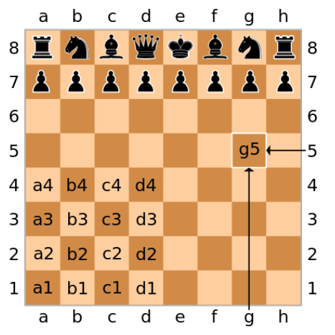

# Progetto assegnato: scacchi 

* Applicazione per il gioco _2-players_ degli scacchi, con interfaccia a linea di comando (CLI)
* Le mosse sono descritte in notazione algebrica https://it.wikipedia.org/wiki/Notazione_algebrica

– 1.e4 e5

– 2.Cf3 Cc6

– 3.d4
