# Relazione tecnica finale

## Indice

1. [Introduzione](#Introduzione)
2. [Modello di dominio](#Modello-di-dominio)
3. [Requisiti specifici](#Requisiti-specifici) <br>
a. [Requisiti funzionali](#Requisiti-funzionali) <br>
b. [Requisiti non funzionali](#Requisiti-non-funzionali)

4. [System Design](#System-Design)
    - [Stile architetturale adottato](#Stile-architetturale-adottato)
    - [Diagramma dei package](#Diagramma-dei-package)
5. [O.O. Design](#OO-Design)
    - [Diagrammi delle classi e diagrammi di sequenza](#Diagrammi-delle-classi-e-diagrammi-di-sequenza) <br>(per le user story considerate più importanti)
    - [Design pattern utilizzati](#Design-pattern)
    - [Commenti](#Commenti)
6. [Riepilogo dei test](#Riepilogo-dei-test)
    - [Tabella riassuntiva di coveralls](#Tabella-riassuntiva)
7. [Manuale utente](#Manuale-utente)
8. [Processo di sviluppo e organizzazione del lavoro](#Processo-di-sviluppo-e-organizzazione-del-lavoro)
9. [Analisi retrospettiva](#Analisi-retrospettiva)
    - [Soddisfazioni](#Soddisfazioni)
    - [Insoddisfazioni](#Insoddisfazioni)
    - [Cosa ci ha fatti impazzire](#Cosa-ci-ha-fatti-impazzire)

# Introduzione
Scacchi-LeCun è un' applicazione per il gioco degli scacchi con interfaccia a linea di comando.
Il gioco accetta comandi in notazione algebrica italiana abbreviata e permette a due giocatori
di sfidarsi localmente. <br>
L'esecuzione avviene a linea di comando via [Docker](https://hub.docker.com/).
Il progetto è stato realizzato durante il corso di Ingegneria del Software dal gruppo LeCun
(a.a. 2019/2020), i cui membri sono:
- [Giuseppe Lamantea](https://github.com/llamandtea)
- [Raffaele Disabato](https://github.com/Raffo99)
- [Giovanni Pio Delvecchio](https://github.com/GiovanniPioDelvecchio)
- [Domenico Dell'Olio](https://github.com/DomMcOyle) <br><br>


[Torna all'indice](#Indice)

# Modello di dominio
<center>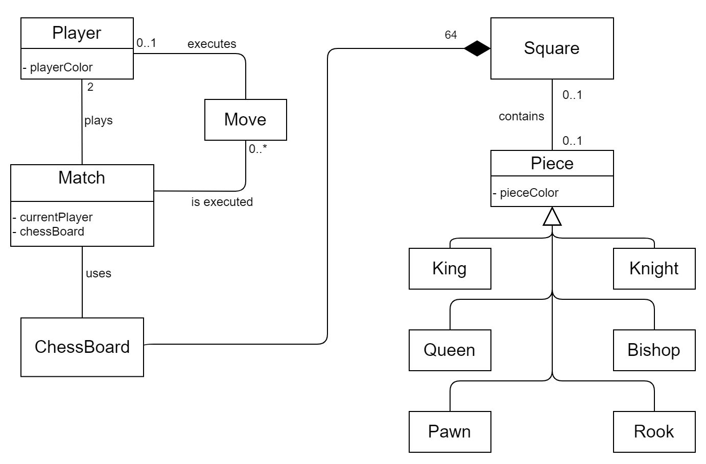</center>

 <br><br>

[Torna all'indice](#Indice)

# Requisiti Specifici

Di seguito sono riportati i requisiti funzionali (in ordine cronologico rispetto alla creazione degli issue corrispondenti) seguiti dai requisiti non funzionali.


## Requisiti funzionali 

- [Inizio gioco](https://github.com/softeng1920-inf-uniba/progetto1920-lecun/issues/25)

    L'utente può predisporre l'applicazione a ricevere i comandi, tramite <code>play</code>.
    Subito dopo sarà dunque possibile inserire la prima mossa di gioco (del bianco). 
    L'applicazione può anche ricevere altri comandi (di gioco) ad esempio <code>board</code> (per mostrare la scacchiera).

    <b>Criteri di accettazione:</b>

    All'immisione del comando <code>play</code> viene visualizzato il messaggio di inizio gioco: 
    <code>Nuova Partita! Inizia il bianco:</code>
    ed il programma si predisone a mostrare un comando o una mossa valida.
    Nel caso in cui l' utente scriva <code>play</code> mentre una partita è in corso viene stampato un messaggio di conferma. Se l'utente conferma comincia una nuova partita,
    in caso contrario rimane accessibile quella corrente.

- [Chiudere il gioco](https://github.com/softeng1920-inf-uniba/progetto1920-lecun/issues/26)

    L'utente può terminare l'applicazione tramite il comando <code>quit</code>.

    <b>Criteri di accettazione:</b>

    All' immissione del comando <code>quit</code> viene visualizzato un messaggio che chiede conferma
    all'utente sulla chiusura del comando. Nel caso in cui l'utente risponda in modo affermativo, l'utente torna ad interagire con il sistema operativo. Se la risposta è negativa, continua ad interagire con l'applicazione.


- [Comando help](https://github.com/softeng1920-inf-uniba/progetto1920-lecun/issues/27)

    L'utente può visualizzare l'elenco dei comandi disponibili tramite il comando <code>help</code>. 
    
     <b>Criteri di accettazione:</b>
    
    Eseguendo il comando <code>help
    </code>, il risultato è una lista di comandi, uno per riga, ovvero: <br>
    
    <code>help  </code> <br>
    <code>play </code><br>
   <code> quit </code><br>
   <code> Riconosciuti solo in-game: </code><br>
   <code> moves </code><br>
    <code>board </code><br>
    <code>capture </code><br>
    

- [Mostrare scacchiera](https://github.com/softeng1920-inf-uniba/progetto1920-lecun/issues/28)

    L'utente può mostrare a schermo la scacchiera tramite il comando <code>board</code>.
    
     <b>Criteri di accettazione:</b>
     
     
     il formato della scacchiera deve essere quello presente in <code>[Assegnazione progetto.md](../Assegnazione%20progetto.md)</code>. Tutti i pezzi sono rappresentati nel contesto della tastiera in UTF-8 con i caratteri specifici (es. ♔ e ♚ per re bianco e nero).
     <center>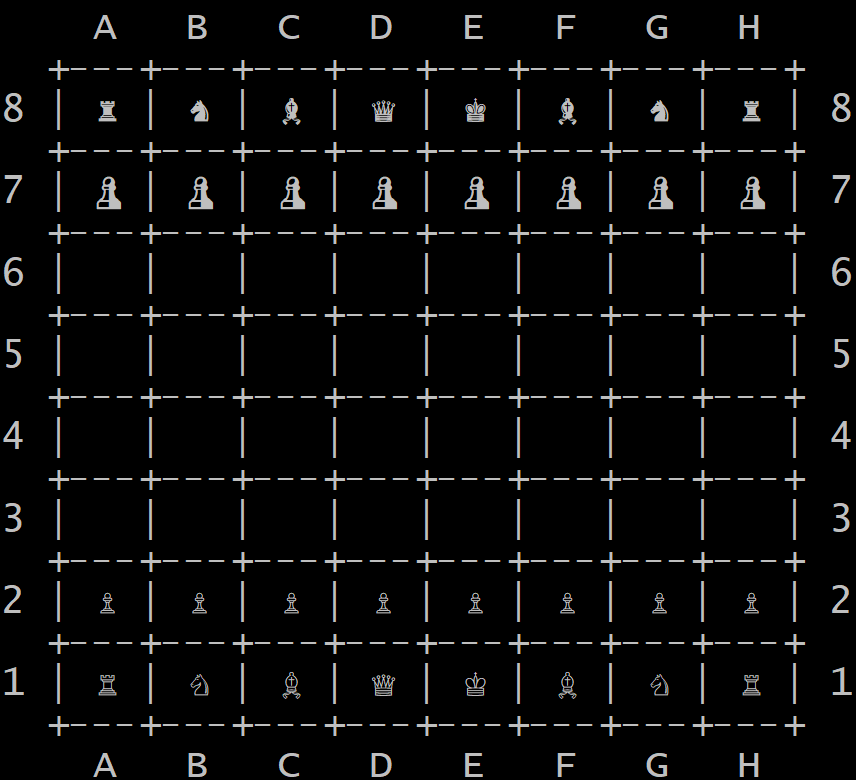</center>

- [Mostrare le mosse giocate](https://github.com/softeng1920-inf-uniba/progetto1920-lecun/issues/29)

    L'utente può visualizzare le mosse giocate (quindi riconosciute ed attuate dal programma)
    tramite il comando <code>moves</code>.

     <b>Criteri di accettazione:</b>

    Tramite il comando <code>moves</code> viene stampata la successione di mosse effettuate nel corso della partita, in notazione algebrica abbreviata, secondo la sintassi:
   
    <code>1. e4 e5</code> <br> 
    <code>2. Cf3 Cc6 </code>  <br>
    <code>3. d4 </code>  <br>
    

    Come mostrato nel file <code>[Assegnazione progetto.md](../Assegnazione%20progetto.md)</code>.

- [Muovere un Pedone](https://github.com/softeng1920-inf-uniba/progetto1920-lecun/issues/30)

    L'utente può muovere un pedone inserendo il comando in notazione algebrica abbreviata,
    rispettando le regole degli scacchi. 
    
     <b>Criteri di accettazione:</b>

    Con il pedone l'utente può:
    - muoversi in una sola direzione (a seconda del colore);
    - catturare normalmente ed en passant (per quest' ultimo caso è possibile aggiungere 
    e.p. nel comando, in conformità con la notazione).

    All'immissione di una mossa valida come:
    - e4
    - f5
    - exf5

    il programma aggiorna lo stato della scacchiera, altrimenti viene visualizzato un messaggio di errore e
    l'applicazione rimane in attesa di un nuovo comando.

    Sono anche valide le catture en passant:
    - exf6
    - exf6 e.p.


- [Visualizzare le catture](https://github.com/softeng1920-inf-uniba/progetto1920-lecun/issues/31)

    L'utente deve poter visualizzare le catture effettuate durante la partita tramite il comando <code>capture</code>.
    
     <b>Criteri di accettazione:</b>

    con il comando <code>capture</code> vengono stampate le catture sia del bianco che del nero, attraverso i relativi caratteri nella codifica Unicode, nel seguente modo:
    
    <code> [♟, ♟, ♟] </code> <br>
    <code> [♗, ♕, ♘, ♖] </code> <br>
    

- [Muovere un Cavallo](https://github.com/softeng1920-inf-uniba/progetto1920-lecun/issues/101)

    L'utente può muovere un cavallo inserendo il comando in notazione algebrica abbreviata, rispettando le regole degli scacchi. 
    
     <b>Criteri di accettazione:</b>

    Con il cavallo l'utente può:
    - muoversi e catturare alternativamente su case bianche e case nere. Il movimento di questo pezzo può essere descritto come due passi in orizzontale (verticale) seguito da un passo in verticale (orizzontale).
    Questo movimento forma idealmente una "L";
    - ignorare i pezzi lungo il suo percorso (tranne quello che si trova sulla casa di arrivo);

    All'immissione di una mossa valida come:
    - Cc3
    - Cxd3

    il programma aggiorna lo stato della scacchiera, altrimenti viene visualizzato un messaggio di errore e
    l'applicazione rimane in attesa di un nuovo comando.

- [Muovere un Alfiere](https://github.com/softeng1920-inf-uniba/progetto1920-lecun/issues/102)

    L'utente può muovere un alfiere inserendo il comando in notazione algebrica abbreviata, rispettando
    le regole degli scacchi. 
    
     <b>Criteri di accettazione:</b>

    Con l'alfiere l'utente può:
    - muoversi e catturare sulle case che si trovano lungo le diagonali (rispetto all'alfiere stesso),
    ammesso che le case siano libere.
    - non può spostarsi su una casa di un colore differente rispetto al colore di quella su cui si trova.

    All'immissione di una mossa valida come:
    - Ac4
    - Axa6

    il programma aggiorna lo stato della scacchiera, altrimenti viene visualizzato un messaggio di errore e
    l'applicazione rimane in attesa di un nuovo comando.

- [Muovere una Torre](https://github.com/softeng1920-inf-uniba/progetto1920-lecun/issues/103)

    L'utente può muovere una torre inserendo il comando in notazione algebrica abbreviata, rispettando
    le regole degli scacchi. 
    
     <b>Criteri di accettazione:</b>

    Con la torre l'utente può:
    - muoversi e catturare orizzontalmente e verticalmente (rispetto alla torre stessa), ammesso che le case siano libere;

    All'immissione di una mossa valida come:
    - Ta5
    - Txd4

    il programma aggiorna lo stato della scacchiera, altrimenti viene visualizzato un messaggio di errore e
    l'applicazione rimane in attesa di un nuovo comando.

- [Muovere una Donna](https://github.com/softeng1920-inf-uniba/progetto1920-lecun/issues/104)

    L'utente può muovere una donna inserendo il comando in notazione algebrica abbreviata, rispettando le regole degli scacchi. 
    
     <b>Criteri di accettazione:</b>

    Con la donna l'utente può:
    - muoversi e catturare orizzontalmente e verticalmente ed in diagonale (rispetto alla donna stessa),
    ammesso che le case siano libere.

    All'immissione di una mossa valida come:
    - Dd4
    - Dxf5

    il programma aggiorna lo stato della scacchiera, altrimenti viene visualizzato un messaggio di errore e
    l'applicazione rimane in attesa di un nuovo comando.

- [Muovere un Re](https://github.com/softeng1920-inf-uniba/progetto1920-lecun/issues/107)

    L'utente può muovere un re inserendo il comando in notazione algebrica abbreviata, rispettando le regole degli scacchi. 
    
     <b>Criteri di accettazione:</b>

    Con il re l'utente può:
    - muoversi in tutte le direzioni di una sola casella (rispetto a quella di partenza), ammesso che non sia ostruita;
    - non può muoversi in case minacciate da pezzi avversari (non deve mai rischiare la cattura);

    All'immissione di una mossa valida come:
    - Re2
    - Rxd2

    il programma aggiorna lo stato della scacchiera, altrimenti viene visualizzato un messaggio di errore e
    l'applicazione rimane in attesa di un nuovo comando.
    
- [Arroccare corto](https://github.com/softeng1920-inf-uniba/progetto1920-lecun/issues/115)

    L'utente può effettuare l' arrocco corto inserendo il comando in notazione algebrica abbreviata, rispettando le regole degli scacchi. 

     <b>Criteri di accettazione:</b>

    Al fine della corretta esecuzione dell' arrocco è necessario che lo stato del gioco rispetti i seguenti requisiti:

    - il giocatore non ha mai mosso il re;
    - il giocatore non ha mai mosso la torre coinvolta nell'arrocco;
    - non ci sono pezzi tra il re e la torre coinvolta;
    - il re e la torre devono trovarsi sulla stessa traversa (questa regola venne introdotta nel 1972 quando si scoprì che le regole altrimenti permettevano l'arrocco in verticale con un pedone promosso a torre); 
    - il re non deve essere sotto scacco;
    - il re, durante il movimento dell'arrocco, non deve attraversare caselle in cui si troverebbe sotto scacco.

    All'immissione delle mosse valide per l'arrocco: 
    - 0-0
    - O-O

    il programma aggiorna lo stato della scacchiera, altrimenti viene visualizzato un messaggio di errore e
    l'applicazione rimane in attesa di un nuovo comando.


- [Arroccare lungo](https://github.com/softeng1920-inf-uniba/progetto1920-lecun/issues/116)

    L'utente può effettuare l' arrocco lungo inserendo il comando in notazione algebrica abbreviata, rispettando le regole degli scacchi. 

    <b>Criteri di accettazione:</b>

    Al fine della corretta esecuzione dell' arrocco è necessario che lo stato del gioco rispetti i seguenti requisiti:

    - il giocatore non ha mai mosso il re;
    - il giocatore non ha mai mosso la torre coinvolta nell'arrocco;
    - non ci sono pezzi tra il re e la torre coinvolta;
    - il re e la torre devono trovarsi sulla stessa traversa (questa regola venne introdotta nel 1972 quando si scoprì che le regole altrimenti permettevano l'arrocco in verticale con un pedone promosso a torre); 
    - il re non deve essere sotto scacco;
    - il re, durante il movimento dell'arrocco, non deve attraversare caselle in cui si troverebbe sotto scacco.

    All'immissione delle mosse valide per l'arrocco:
    - 0-0-0
    - O-O-O

    il programma aggiorna lo stato della scacchiera, altrimenti viene visualizzato un messaggio di errore e
    l'applicazione rimane in attesa di un nuovo comando.

 <br><br>

[Torna all'indice](#Indice)

## Requisiti non funzionali 

- ### Portabilità
    L'applicazione è disponibile per le seguenti piattaforme:
    - terminale di Linux;
    - teminale di MacOS;
    - Windows Terminal;
    - Git Bash  (in questo caso il comando Docker ha come prefisso winpty; es:  
    <code>winpty docker -it ...</code>)

- ### Affidabilità
    L'applicazione è progettata per evitare eccezioni non gestite, le eccezioni vengono cattuarate
    e gestite, inoltre per ogni situazione non valida è stampato un messaggio.

- ### Manutenibilità

    Il codice è stato suddiviso in diverse sottoclassi: 
    - la presenza di una classe UI separa il comportamento effettivo del gioco dall'interfaccia,
    rendendo possibile modificare la logica di business da quella di visualizzazione;
    - è stata creata una classe contenente tutte le costanti, che potrebbe essere successivamente 
    sostituita da un file;


 <br><br>

[Torna all'indice](#Indice)

# System Design

## Stile architetturale adottato
E' stato adottato lo stile architetturale Model-View-Controller, per via della caratteristica, presentata anche fra i requisiti non funzionali, di separare la logica di business dalla presentazione. 

I tre componenti che implementano questa architettura sono:

- <b>Model</b>

    La logica di business è concentrata quasi del tutto all'interno della classe <code>Match</code>. <br>
    Essa espone, infatti, i metodi necessari per modellare il comportamento di una partita a scacchi, gestendo le strutture dati utilizzate per rappresentare la scacchiera, aggiornandole in base all'input (ammesso che siano stati inseriti comandi corretti)
    proveniente da UI (controller). <br>
    La classe <code>Match</code> non interagisce mai con l'interfaccia CLI su cui sono stampati i messaggi.

- <b>View</b> 

    E' possibile visualizzare i risultati delle elaborazioni tramite l'interfaccia CLI (Command Line Interface) adottata per realizzare questo progetto.<br>
    Tutto ciò che viene mostrato su tale interfaccia è stampato tramite la classe <code>UI</code>, dunque l'interfaccia CLI non interagisce mai con la classe <code>Match</code> se non attraverso <code>UI</code>.


- <b>Controller</b>

    L'interazione con l'utente avviene tramite la classe <code>UI</code> che chiede direttamente le conferme all'utente, ma riceve dalla classe AppMain la stringa corrispondente al comando inserito. <br>
    A <code>UI</code> sono demandati i compiti di acquisizione dei comandi e stampa a video (sulla CLI) dei messaggi corrispondenti ad ogni comando. <br>
    <code>Match</code> lancia messaggi di errore e modifica le strutture dati, tuttavia non interagisce mai direttamente con l'utente, poiché è <code>UI</code> a catturare le <code>MatchException</code> lanciate e stampare tramite CLI i relativi messaggi, ed è sempre <code>UI</code> a stampare scacchiera, mosse effettuate, pezzi catturati ed help.


## Diagramma dei package

<center></center>

 <br><br>

[Torna all'indice](#Indice)

# O.O. Design

## Diagrammi delle classi e diagrammi di sequenza

### Diagramma delle classi con prospettiva software completo
<center>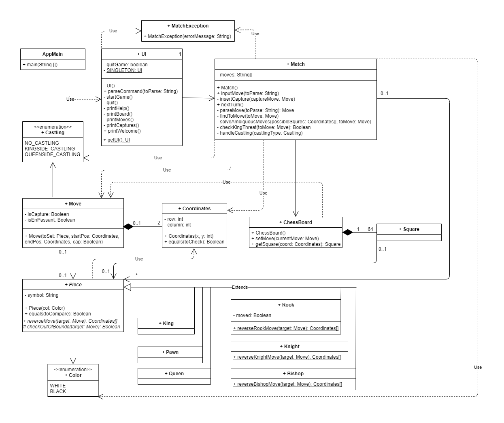</center>

### Diagramma delle classi con prospettiva software per la user story "Muovere una torre"
<center></center>

### Diagramma di sequenza per la user story "Muovere una torre"
<center>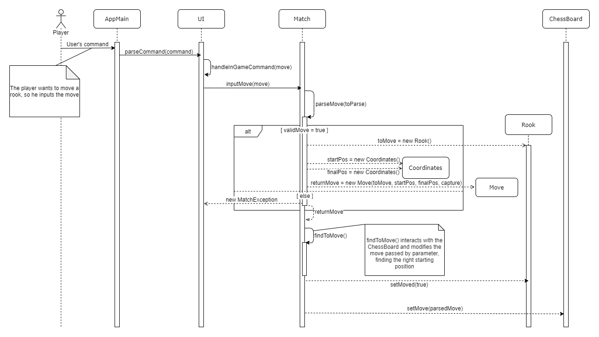</center>

### Diagramma di sequenza per la user story "Inizio gioco"
<center>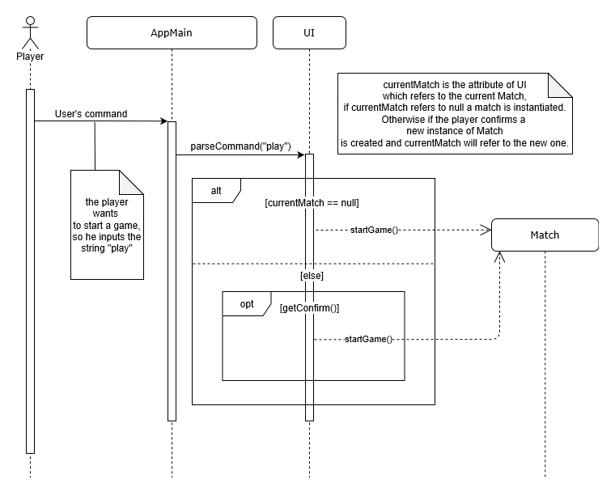</center>

### Diagramma di sequenza per la user story "Mostrare scacchiera"
<center>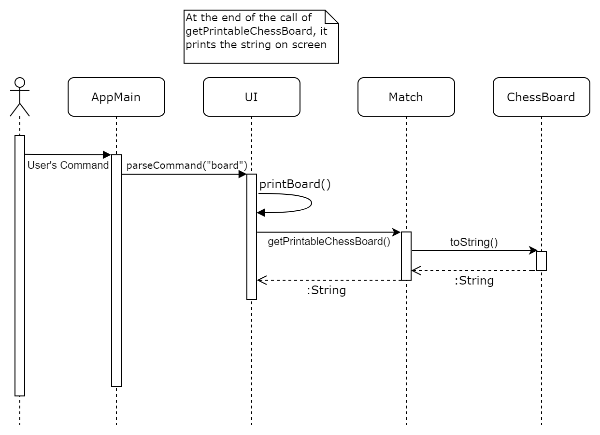</center>

 <br><br>

[Torna all'indice](#Indice)

## Design pattern

Nel progetto sono stati applicati i seguenti Design Pattern appartenenti al paradigma orientato
agli oggetti:
- Singleton (pattern di creazione)
- Chain of Responsabilities (pattern comportamentale)

Il pattern di creazione **Singleton** è stato applicato nella classe `UI`. Questa scelta è stata
fatta poiché a livello implementativo è necessaria la presenza di una sola istanza di essa che
interagirà con l'utente.

Il pattern comportamentale **Chain of Responsabilities** è invece utilizzato per garantire un
basso accoppiamento fra classi, assegnando ad ognuna di esse una particolare responsabilità nella
gestione di una richiesta da parte di un giocatore. Un esempio può essere ritrovato nel
diagramma di sequenza associato alla user story
[Mostrare scacchiera](https://github.com/softeng1920-inf-uniba/progetto1920-lecun/issues/28):
a conoscere la modalità di richiesta di visualizzazione della scacchiera è solo `UI`, che a sua volta 
presenterà l'output del metodo `getPrintableChessBoard()` fornito dall'istanza della classe 
`Match`.

## Commenti

Lo sviluppo dell'applicazione è partito da una sessione di *forward engineering*, che ha definito
la sua struttura iniziale. Ogni componente del team ha collaborato all'ideazione di questa 
bozza di progetto, che durante lo sviluppo ha ovviamente subìto cambiamenti, dovuti alle
necessità emerse in corso d'opera.

### Diagramma delle classi con prospettiva software (bozza effettuata in forward engineering)
<center>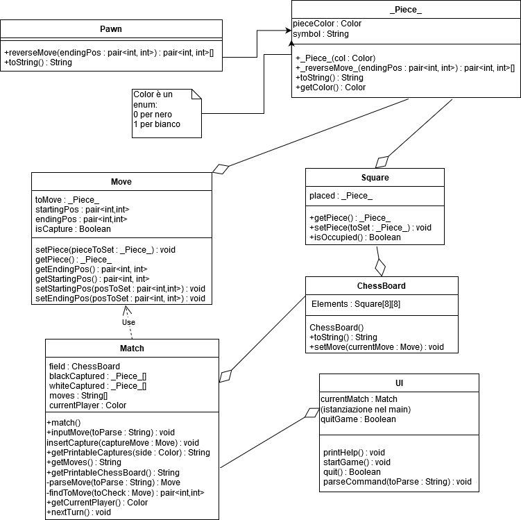</center>

<br><br>

[Torna all'indice](#Indice)

# Riepilogo dei test
## Tabelle riassuntiva
Qui di seguito presentiamo:
- La tabella riassuntiva del coverage generata da _JaCoCo_;
<center>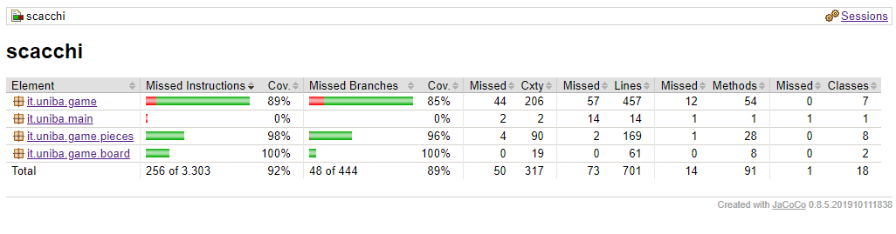</center>

- Il report sul numero di test eseguiti;
<center>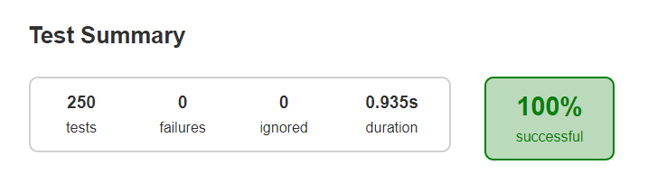</center>

- Infine, il report di [Coveralls](https://coveralls.io/github/softeng1920-inf-uniba/progetto1920-lecun?branch=master).

<center>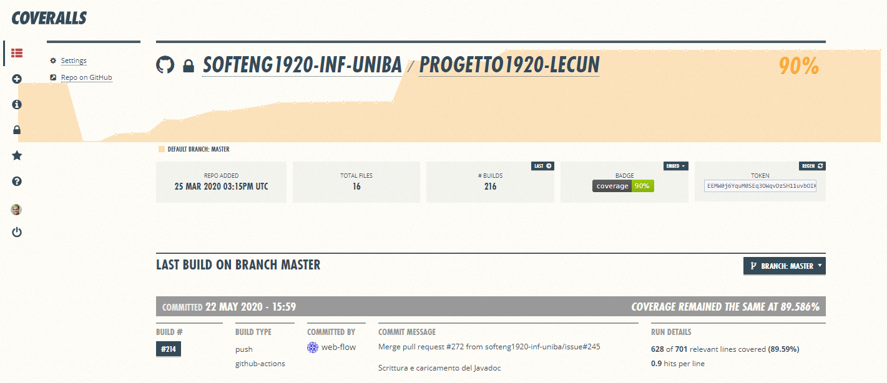</center>
<center>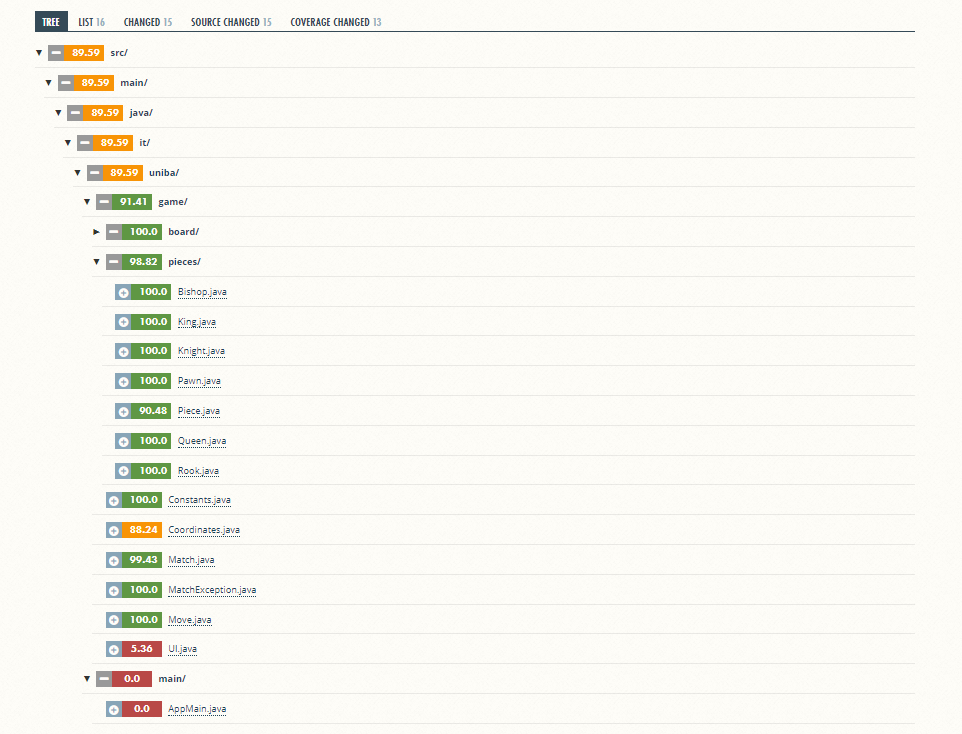</center>


 <br><br>

[Torna all'indice](#Indice)

# Manuale utente
Dopo aver eseguito Docker desktop ed aver scaricato l'immagine, è possibile eseguire l'applicazione col comando:
<center>

 ``` docker run -it --rm docker.pkg.github.com/softeng1920-inf-uniba/docker_1920/lecun:latest ``` </center><br>
 Se il programma viene avviato correttamente da una delle _shell_ indicate (altre potrebbero non supportare l'UTF e generare quindi un messaggio di errore), viene visualizzato a schermo il messaggio:<br>
 <center>
<code> &#9812; Benvenuto! per conoscere i comandi digita 'help' &#9822;</code>
</center>

Da qui è possibile inserire i seguenti comandi:
- <code>help</code>: come suggerito dal banner, elenca tutti i possibili comandi accettati dal programma, distinguendo quali sono esclusivamente eseguibili in partita.
- <code>quit</code>: comando per chiudere l'applicazione. Una volta invocato, il programma richiede una conferma ("si" o "no") e in caso affermativo termina l'applicazione.
- <code>play</code>: comando per cominciare una nuova partita. Se richiamato quando una partita è già in corso, viene chiesta anche qui una conferma per ricominciare la paritita da zero("si" o "no"); in caso affermativo la partita ricomincia, altrimenti la partita continua normalmente.

I comandi che vengono eseguiti esclusivamente durante una partita (Alternativamente non vengono riconosciuti) sono:
- <code>board</code>: comando per stampare a schermo lo stato attuale della scacchiera in caratteri **UNICODE**.
- <code>moves</code>: comando per stampare a schermo la storia delle mosse eseguite durante la partita. Il formato di stampa è in coppie di semimosse, del tipo:

    <code> 1. e4 d5 </code>

    Le mosse irregolari o illegali non sono visualizzate.
- <code>captures</code>: comando per mostrare a schermo i pezzi catturati. Il formato di stampa presenta prima le catture del bianco, cioè i pezzi neri, e poi le catture del nero, cioè i pezzi bianchi. Eventuali catture ottenute attraverso mosse irregolari o illegali non sono memorizzate. Infine se nessuna cattura è stata effettuata, viene visualizzato:
    
    <code>[]</code><br><code>[]</code>

Una volta eseguito il comando di inizio partita il programma si mette in attesa di una mossa del bianco. Se la mossa è corretta (sia sintatticamente che semanticamente e nel rispetto delle regole del gioco) viene eseguita e il turno viene automaticamente aggiornato.

La mossa deve seguire la sintassi della _**[notazione algebrica ridotta italiana](https://it.wikipedia.org/wiki/Notazione_algebrica)**_, e sono riconosciute anche le varianti "e.p." per l'_en passant_ e le "O" al posto degli "0" per l'arrocco mentre al momento non sono supportate le meccaniche di scacco e promozione e le relative stringhe.

In caso di errori nella mossa sono visualizzati i seguenti messaggi:

- <code>La mossa o il comando inserito non è stato riconosciuto</code>: Errore nella sintassi della mossa.
- <code>Mossa Ambigua</code>: La mossa necessita una disambiguazione sulla colonna o riga di partenza(es. Le torri in a8 e h6 possono entrambi raggiungere la casa a6 col comando Ta6).
- <code> Disambiguazione mal specificata</code>: Precisazione sulla mossa fornita ma con la componente di disambiguazione errata (es. comunicata la riga al posto della colonna, la riga errata, ecc.).
- <code>Impossibile eseguire En Passant sul pezzo selezionato</code>: Tentativo di _en passant_ su un pezzo diverso dal Pedone.
- <code>La mossa en passant deve essere una cattura</code>: _En passant_ non specificato come cattura.
- <code>En passant non eseguibile</code>: Errore relativo ad una mossa di _en passant_ non rientrante nella casistica precedente (es. tentativo di e.p. fuori tempo, il Pedone avversario non ha eseguito una mossa lunga, ecc.)
- <code>Pezzo non catturabile</code>: Tentativo di cattura di un pezzo del proprio colore.
- <code>Mossa irregolare/illegale</code>: Tentativo di esecuzione di una mossa che porta o mantiene in scacco il Re.
- <code>Arrocco non eseguibile: [specifica]</code>: Tentativo di esecuzione di un arrocco che viola la regola specificata.
- <code>Mossa illegale</code>: Si sta tentando una mossa illegale che non rientra nei casi indcati precedentemente.
 <br><br>

[Torna all'indice](#Indice)

# Processo di sviluppo e organizzazione del lavoro

- ## Processo di sviluppo
    Il processo di sviluppo di questa applicazione è avvenuto in modo iterativo ed incrementale,
    secondo il modello [Scrum](https://it.wikipedia.org/wiki/Scrum_%28informatica%29), prevedendo quattro Sprint separati, ciascuno dei quali avente uno <b>Sprint Goal</b>.


- ## Piattaforma adottata
    Il nostro gruppo ha adottato, per conferenze e condivisione dello schermo, la piattaforma
    <b>[Discord](https://discord.com/) </b>, perché permette di effettuare conferenze di qualità audio e video alta e di effettuare l'upload di files. <br>
    Abbiamo deciso di rimanere in conferenza per tutta la durata delle sessioni di lavoro, come se fossimo nella stessa stanza e potessimo liberalmente alzarci per controllare ciò che stanno facendo i colleghi. <br>

<center>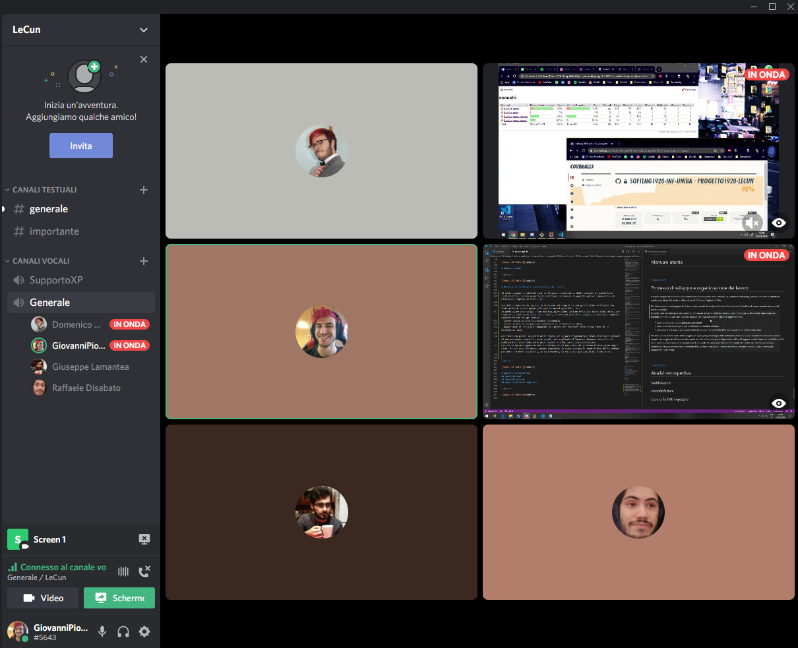</center>

- ## WorkFlow utilizzato
    E' stato adottato il <b>GitHub Flow</b>:
    ogni issue è stata creata in base ai compiti assegnati per ogni sprint, tale issue
    veniva:
    - assegnata ad un membro del team se non ulteriormente decomponibile;
    - suddivisa in issue minori se il task da completare era particolarmente complesso;
    - assegnata a coppie per il pair programming se il task era mediamente complesso o serviva
    particolare attenzione e/o ragionamento;
    - assegnata a tutti per motivi quali complessità di realizzazione o necessità di pareri espressi esplicitamente.

- ## Suddivisione dei compiti
    Fin dalla creazione del gruppo la divisione dei compiti da svolgere è stata effettuata con l'obiettivo di essere quanto più equi ed onesti possibile. <br>
    In particolare durante gli scrum meetings giornalieri tenuti durante i primi dieci-quindici minuti abbiamo ripartito i task delle issue tra i membri, in modo da allocare i compiti in base alle seguenti caratteristiche di ogni membro:
    - lavoro svolto durante le giornate precedenti;
    - lavoro ancora da svolgere per soddisfare il definition of done;
    - propensione di uno o più componenti del gruppo nei confronti della risoluzione di un determinato task;

    Giornalmente venivano anche stabilite le priorità dei task da portare a termine. <br>
    Il lavoro è stato suddiviso anche dandosi delle deadlines con cadenza settimanale, in base
    a ciò che era stato assegnato per ogni milestone. <br>


- ## Pair programming e revisione
    Per tasks più o meno grandi, la scelta delle coppie per il pair programming è stata
    effettuata cercando di non mantenere sempre gli stessi membri, ma scegliendo di lavorare 
    formando tutte le sei combinazioni, riportando nelle pull request e nelle issues tale
    suddivisione. <br>
    Per via di questa organizzazione è capitato più di una volta che qualcuno finisse prima
     degli altri, in tal caso chi doveva ancora completare la issue, avviava la condivisione 
    dello schermo per poter ricevere assistenza, in ogni momento, da chi aveva già completato i 
    suoi tasks. <br>
    Anche il lavoro di revisione è stato effettuato subito dopo il completamento di ogni task
    tramite condivisione schermo e/o commentando la pull request per tenere traccia dei punti 
    salienti della discussione. <br>


- ## Uso delle boards
    La board in stile kanban ci ha aiutati per quanto riguarda il recupero del lavoro 
    quando un task non veniva portato a termine entro la giornata stessa. <br> Tale board, 
    fornita da <b>GitHub</b> è stata popolata con i vari issues, che sotto forma di <i>cards</i>
    possono essere posti su <i>5</i> colonne:
    - <b>TO DO</b> dove finivano automaticamente le issue appena create, da svolgere;
    - <b>IN PROGRESS</b> dove si trovavano issue su cui qualcuno sta lavorando;
    - <b>REVIEW</b> dove venivano collocate le issues da revisionare dai componenti del team;
    - <b>READY</b> dove si posizionavano le issues da revisionare da parte dei docenti;
    - <b>DONE</b> dove si aggiungevano le issues portate a termine e ufficialmente chiusi;

    E' stata creata una [project board di progetto](https://github.com/softeng1920-inf-uniba/progetto1920-lecun/projects/3) (per le user stories) e le seguenti sprint boards:
    - [Sprint 0](https://github.com/softeng1920-inf-uniba/progetto1920-lecun/projects/1) 
    - [Sprint 1](https://github.com/softeng1920-inf-uniba/progetto1920-lecun/projects/2) 
    - [Sprint 2](https://github.com/softeng1920-inf-uniba/progetto1920-lecun/projects/4) 
    - [Sprint 3](https://github.com/softeng1920-inf-uniba/progetto1920-lecun/projects/5)


 <br><br>

[Torna all'indice](#Indice)

# Analisi retrospettiva
## Soddisfazioni
## Insoddisfazioni
## Cosa ci ha fatti impazzire

 <br><br>

[Torna all'indice](#Indice)
