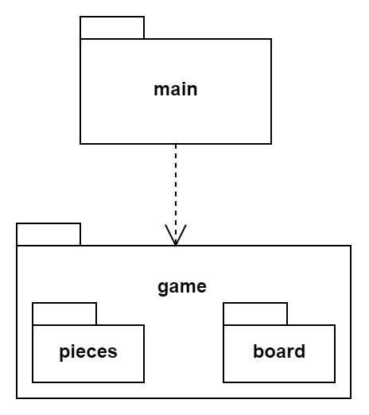
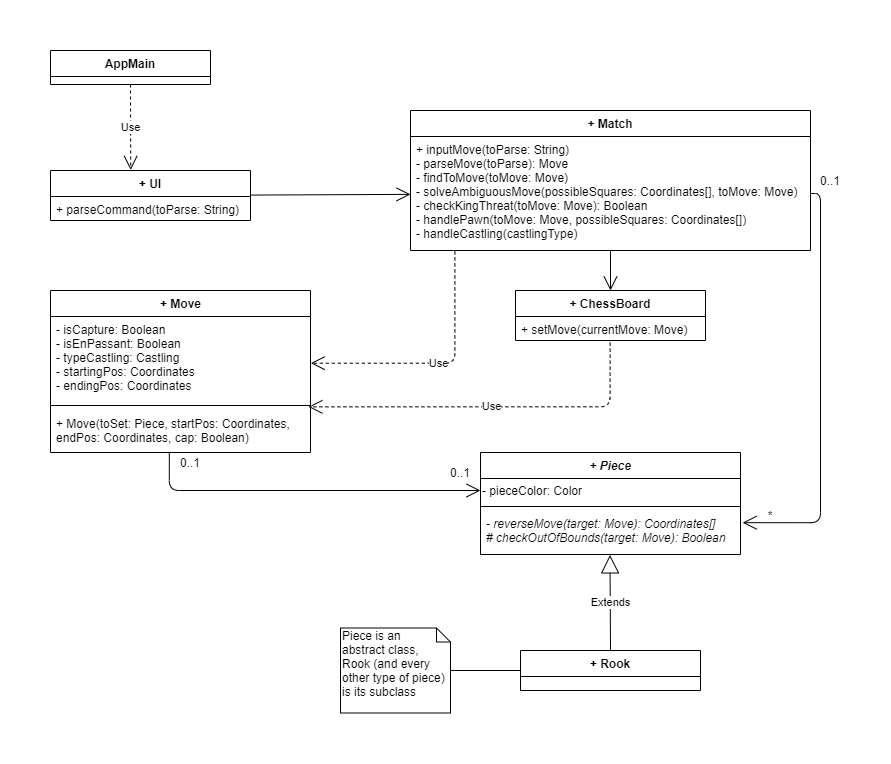
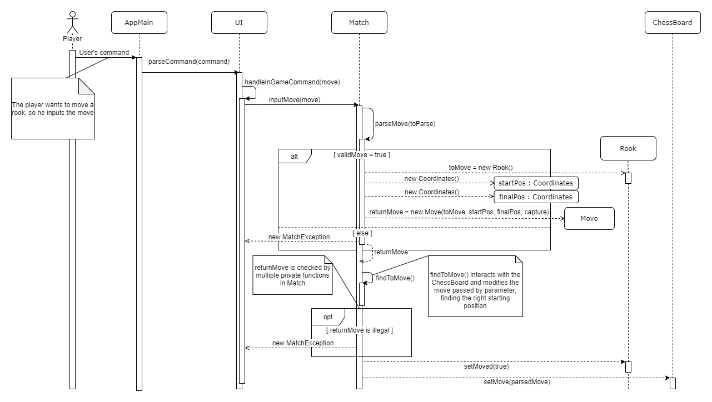
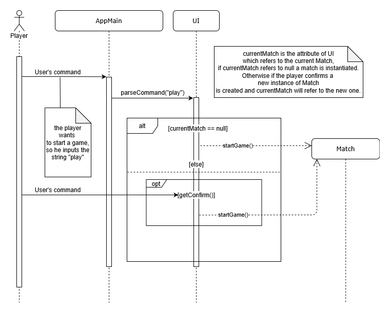

# Relazione tecnica finale

## Indice

1. [Introduzione](#Introduzione)
2. [Modello di dominio](#Modello-di-dominio)
3. [Requisiti specifici](#Requisiti-specifici)  
a. [Requisiti funzionali](#Requisiti-funzionali)  
b. [Requisiti non funzionali](#Requisiti-non-funzionali)

4. [System Design](#System-Design)
    - [Stile architetturale adottato](#Stile-architetturale-adottato)
    - [Diagramma dei package](#Diagramma-dei-package)
5. [O.O. Design](#OO-Design)
    - [Diagrammi delle classi e diagrammi di sequenza](#Diagrammi-delle-classi-e-diagrammi-di-sequenza)  (per le user story considerate più importanti)
    - [Design pattern utilizzati](#Design-pattern)
    - [Commenti](#Commenti)
6. [Riepilogo dei test](#Riepilogo-dei-test)
    - [Tabella riassuntiva di coveralls](#Tabella-riassuntiva)
7. [Manuale utente](#Manuale-utente)
8. [Processo di sviluppo e organizzazione del lavoro](#Processo-di-sviluppo-e-organizzazione-del-lavoro)
9. [Analisi retrospettiva](#Analisi-retrospettiva)
    - [Soddisfazioni](#Soddisfazioni)
    - [Insoddisfazioni](#Insoddisfazioni)
    - [Cosa ci ha fatti impazzire](#Cosa-ci-ha-fatti-impazzire)

# Introduzione
Scacchi-LeCun è un' applicazione per il gioco degli scacchi con interfaccia a linea di comando.
Il gioco accetta comandi in notazione algebrica italiana abbreviata e permette a due giocatori
di sfidarsi localmente.  
L'esecuzione avviene a linea di comando via [Docker](https://hub.docker.com/).
Il progetto è stato realizzato durante il corso di Ingegneria del Software dal gruppo LeCun
(a.a. 2019/2020), i cui membri sono:
- [Giuseppe Lamantea](https://github.com/llamandtea)
- [Raffaele Disabato](https://github.com/Raffo99)
- [Giovanni Pio Delvecchio](https://github.com/GiovanniPioDelvecchio)
- [Domenico Dell'Olio](https://github.com/DomMcOyle)   

[Torna all'indice](#Indice)

# Modello di dominio

   

[Torna all'indice](#Indice)

# Requisiti Specifici

Di seguito sono riportati i requisiti funzionali (in ordine cronologico rispetto alla creazione degli issue corrispondenti) seguiti dai requisiti non funzionali.

## Requisiti funzionali 

- [Inizio gioco](https://github.com/softeng1920-inf-uniba/progetto1920-lecun/issues/25)

    L'utente può predisporre l'applicazione a ricevere i comandi, tramite <code>play</code>.
    Subito dopo sarà dunque possibile inserire la prima mossa di gioco (del bianco). 
    L'applicazione può anche ricevere altri comandi (di gioco) ad esempio <code>board</code> (per mostrare la scacchiera).

     <b>Criteri di accettazione:</b>

    All'immisione del comando <code>play</code> viene visualizzato il messaggio di inizio gioco: 
    <code>Nuova Partita! Inizia il bianco:</code>
    ed il programma si predisone a mostrare un comando o una mossa valida.

- [Chiudere il gioco](https://github.com/softeng1920-inf-uniba/progetto1920-lecun/issues/26)

    L'utente può terminare l'applicazione tramite il comando <code>quit</code>, in tal caso viene chiesta conferma all'utente e 

     <b>Criteri di accettazione:</b>

    All' immissione del comando <code>quit</code> viene visualizzato un messaggio che chiede conferma
    all'utente sulla chiusura del comando. Nel caso in cui l'utente risponda in modo affermativo, l'utente torna ad interagire con il sistema operativo. Se la risposta è negativa, continua ad interagire con l'applicazione.

- [Comando help](https://github.com/softeng1920-inf-uniba/progetto1920-lecun/issues/27)

    L'utente può visualizzare l'elenco dei comandi disponibili tramite il comando <code>help</code>. 
    
     <b>Criteri di accettazione:</b>
    
    Eseguendo il comando <code>help
    </code>, il risultato è una lista di comandi, uno per riga, ovvero:  
    
    <code>help  </code>  
    <code>play </code> 
   <code> quit </code> 
   <code> Riconosciuti solo in-game: </code> 
   <code> moves </code> 
    <code>board </code> 
    <code>capture </code> 
    

- [Mostrare scacchiera](https://github.com/softeng1920-inf-uniba/progetto1920-lecun/issues/28)

    L'utente può mostrare a schermo la scacchiera tramite il comando <code>board</code>.
    
     <b>Criteri di accettazione:</b>
     
     il formato della scacchiera deve essere quello presente in <code>[Assegnazione progetto.md](../Assegnazione%20progetto.md)</code>. Tutti i pezzi sono rappresentati nel contesto della tastiera in UTF-8 con i caratteri specifici (es. ♔ e ♚ per re bianco e nero).

- [Mostrare le mosse giocate](https://github.com/softeng1920-inf-uniba/progetto1920-lecun/issues/29)

    L'utente può visualizzare le mosse giocate (quindi riconosciute ed attuate dal programma)
    tramite il comando <code>moves</code>.

     <b>Criteri di accettazione:</b>

    Tramite il comando <code>moves</code> viene stampata la successione di mosse effettuate nel corso della partita, in notazione algebrica abbreviata, secondo la sintassi:
   
    <code>1. e4 e5</code>   
    <code>2. Cf3 Cc6 </code>   
    <code>3. d4 </code>   
    

    Come mostrato nel file <code>[Assegnazione progetto.md](../Assegnazione%20progetto.md)</code>.

- [Muovere un Pedone](https://github.com/softeng1920-inf-uniba/progetto1920-lecun/issues/30)

    L'utente può muovere un pedone inserendo il comando in notazione algebrica abbreviata,
    rispettando le regole degli scacchi. 
    
     <b>Criteri di accettazione:</b>

    Con il pedone l'utente può:
    - muoversi in una sola direzione (a seconda del colore);
    - catturare normalmente ed en passant (per quest' ultimo caso è possibile aggiungere 
    e.p. nel comando, in conformità con la notazione).

    Esempi di mosse valide per un pedone:
    - e4
    - f5
    - exf5

    Esempi di mosse valide per l'en passant:
    - exf6
    - exf6 e.p.

- [Visualizzare le catture](https://github.com/softeng1920-inf-uniba/progetto1920-lecun/issues/31)

    L'utente deve poter visualizzare le catture effettuate durante la partita tramite il comando <code>capture</code>.
    
     <b>Criteri di accettazione:</b>

    con il comando <code>capture</code> vengono stampate le catture sia del bianco che del nero, attraverso i relativi caratteri nella codifica Unicode, nel seguente modo:
    
    <code> [♟, ♟, ♟] </code>  
    <code> [♗, ♕, ♘, ♖] </code>  
    

- [Muovere un Cavallo](https://github.com/softeng1920-inf-uniba/progetto1920-lecun/issues/101)

    L'utente può muovere un cavallo inserendo il comando in notazione algebrica abbreviata, rispettando le regole degli scacchi. 
    
     <b>Criteri di accettazione:</b>

    Con il cavallo l'utente può:
    - muoversi e catturare alternativamente su case bianche e case nere. Il movimento di questo pezzo può essere descritto come due passi in orizzontale (verticale) seguito da un passo in verticale (orizzontale).
    Questo movimento forma idealmente una "L";
    - ignorare i pezzi lungo il suo percorso (tranne quello che si trova sulla casa di arrivo);

    Esempi di mosse valide per il cavallo:
    - Cc3
    - Cxd3

- [Muovere un Alfiere](https://github.com/softeng1920-inf-uniba/progetto1920-lecun/issues/102)

    L'utente può muovere un alfiere inserendo il comando in notazione algebrica abbreviata, rispettando
    le regole degli scacchi. 
    
     <b>Criteri di accettazione:</b>

    Con l'alfiere l'utente può:
    - muoversi e catturare sulle case che si trovano lungo le diagonali (rispetto all'alfiere stesso),
    ammesso che le case siano libere.
    - non può spostarsi su una casa di un colore differente rispetto al colore di quella su cui si trova.

    Esempi di mosse valide per l' alfiere:
    - Ac4
    - Axa6

- [Muovere una Torre](https://github.com/softeng1920-inf-uniba/progetto1920-lecun/issues/103)

    L'utente può muovere una torre inserendo il comando in notazione algebrica abbreviata, rispettando
    le regole degli scacchi. 
    
     <b>Criteri di accettazione:</b>

    Con la torre l'utente può:
    - muoversi e catturare orizzontalmente e verticalmente (rispetto alla torre stessa), ammesso che le case siano libere;

- [Muovere una Donna](https://github.com/softeng1920-inf-uniba/progetto1920-lecun/issues/104)

    L'utente può muovere una donna inserendo il comando in notazione algebrica abbreviata, rispettando le regole degli scacchi. 
    
     <b>Criteri di accettazione:</b>

    Con la donna l'utente può:
    - muoversi e catturare orizzontalmente e verticalmente ed in diagonale (rispetto alla donna stessa),
    ammesso che le case siano libere.

    Esempi di mosse valide per la donna (o regina):
    - Dd4
    - Dxf5

- [Muovere un Re](https://github.com/softeng1920-inf-uniba/progetto1920-lecun/issues/107)

    L'utente può muovere un re inserendo il comando in notazione algebrica abbreviata, rispettando le regole degli scacchi. 
    
     <b>Criteri di accettazione:</b>

    Con il re l'utente può:
    - muoversi in tutte le direzioni di una sola casella (rispetto a quella di partenza), ammesso che non sia ostruita;
    - non può muoversi in case minacciate da pezzi avversari (non deve mai rischiare la cattura);
    
- [Arroccare corto](https://github.com/softeng1920-inf-uniba/progetto1920-lecun/issues/115)

    L'utente può effettuare l' arrocco corto inserendo il comando in notazione algebrica abbreviata, rispettando le regole degli scacchi. 

     <b>Criteri di accettazione:</b>

    Al fine della corretta esecuzione dell' arrocco è necessario che lo stato del gioco rispetti i seguenti requisiti:

    - il giocatore non ha mai mosso il re;
    - il giocatore non ha mai mosso la torre coinvolta nell'arrocco;
    - non ci sono pezzi tra il re e la torre coinvolta;
    - il re e la torre devono trovarsi sulla stessa traversa (questa regola venne introdotta nel 1972 quando si scoprì che le regole altrimenti permettevano l'arrocco in verticale con un pedone promosso a torre); 
    - il re non deve essere sotto scacco;
    - il re, durante il movimento dell'arrocco, non deve attraversare caselle in cui si troverebbe sotto scacco.

    Esempi di arrocco corto (lato re): 
    - 0-0
    - O-O

- [Arroccare lungo](https://github.com/softeng1920-inf-uniba/progetto1920-lecun/issues/116)

    L'utente può effettuare l' arrocco lungo inserendo il comando in notazione algebrica abbreviata, rispettando le regole degli scacchi. 

    <b>Criteri di accettazione:</b>

    Al fine della corretta esecuzione dell' arrocco è necessario che lo stato del gioco rispetti i seguenti requisiti:

    - il giocatore non ha mai mosso il re;
    - il giocatore non ha mai mosso la torre coinvolta nell'arrocco;
    - non ci sono pezzi tra il re e la torre coinvolta;
    - il re e la torre devono trovarsi sulla stessa traversa (questa regola venne introdotta nel 1972 quando si scoprì che le regole altrimenti permettevano l'arrocco in verticale con un pedone promosso a torre); 
    - il re non deve essere sotto scacco;
    - il re, durante il movimento dell'arrocco, non deve attraversare caselle in cui si troverebbe sotto scacco.

    Esempi di arrocco lungo (lato donna):
    - 0-0-0
    - O-O-O

   

[Torna all'indice](#Indice)

## Requisiti non funzionali 

- ### Portabilità
    L'applicazione è disponibile per le seguenti piattaforme:
    - terminale di Linux;
    - teminale di MacOS;
    - Windows Terminal;
    - Git Bash  (in questo caso il comando Docker ha come prefisso winpty; es:  
    <code>winpty docker -it ...</code>)

- ### Affidabilità
    L'applicazione è progettata per evitare eccezioni non gestite, le eccezioni vengono cattuarate
    e gestite, inoltre per ogni situazione non valida è stampato un messaggio.

- ### Manutenibilità

    Il codice è stato suddiviso in diverse sottoclassi: 
    - la presenza di una classe UI separa il comportamento effettivo del gioco dall'interfaccia,
    rendendo possibile modificare la logica di business da quella di visualizzazione;
    - è stata creata una classe contenente tutte le costanti, che potrebbe essere successivamente 
    sostituita da un file;

   

[Torna all'indice](#Indice)

# System Design

## Stile architetturale adottato

## Diagramma dei package

   

[Torna all'indice](#Indice)

# O.O. Design

## Diagrammi delle classi e diagrammi di sequenza

### Diagramma delle classi con prospettiva software completo

### Diagramma delle classi con prospettiva software per la user story "Muovere una torre"

### Diagramma di sequenza per la user story "Muovere una torre"

### Diagramma di sequenza per la user story "Inizio gioco"

### Diagramma di sequenza per la user story "Mostrare scacchiera"

   

[Torna all'indice](#Indice)

## Design pattern

## Commenti

   

[Torna all'indice](#Indice)

# Riepilogo dei test
## Tabella riassuntiva

   

[Torna all'indice](#Indice)

# Manuale utente

   

[Torna all'indice](#Indice)

# Processo di sviluppo e organizzazione del lavoro

   

[Torna all'indice](#Indice)

# Analisi retrospettiva
## Soddisfazioni
## Insoddisfazioni
## Cosa ci ha fatti impazzire

   

[Torna all'indice](#Indice)
